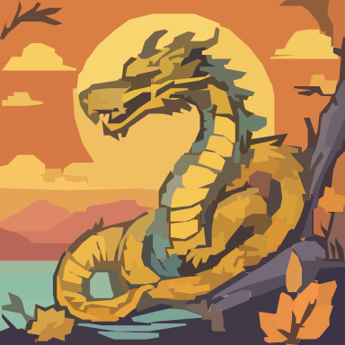
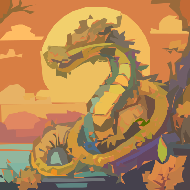
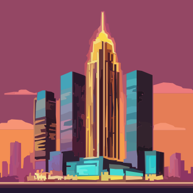
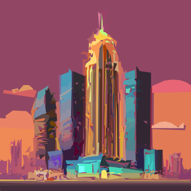

<h1 align="center">✨ Pysvgenius ✨</h1>

<p align="center">
<b>Text ➜ SVG | Image ➜ SVG | Smart SVG Resizing</b><br>
Turn your text or images into optimized, scalable SVGs effortlessly.
</p>

<p align="center">
  <a href="https://pypi.org/project/pysvgenius/">
    
  </a>
  <a href="https://github.com/tamchamchi/pysvgenius/blob/main/LICENSE">
    
  </a>
  <a href="https://www.python.org/">
    
  </a>
  <a href="https://github.com/tamchamchi/pysvgenius/stargazers">
    
  </a>
</p>

---

## 📖 Description

**Pysvgenius** is a Python library that enables:
- **Text to SVG** conversion
- **Image to SVG** vectorization
- **Smart SVG resizing** with optimization

Easily generate scalable vector graphics (SVG) for design, AI, or web applications.

---

## 🖼️ Demo

<div align="center">

| Input | Text-to-Image | Image-to-SVG | Optimized SVG |
|-------|---------------|--------------|---------------|
| **"A lighthouse overlooking the ocean"** |  |  |  |
| **"A serene Asian dragon"** |  |  |  |
| **"Futuristic skyscraper with neon lights"** |  |  |  |

</div>

## 📦 Installation
```bash
# Basic installation
pip install pysvgenius

# With OpenAI CLIP support
pip install pysvgenius[clip]

# Full installation with all extras
pip install pysvgenius[clip,diff_jpeg]
```
### 🔧 (Optional) Build DiffVG for Optimizer


To use advanced **SVG optimization** features, you need to build [diffvg](https://github.com/BachiLi/diffvg) from source.

```bash
# 1. Clone diffvg repository
git clone https://github.com/BachiLi/diffvg.git
cd diffvg

# 2. Initialize submodules
git submodule update --init --recursive

# 3. Install into current Python environment
python setup.py install
```
## 🚀 Usage

### 1️⃣ Text-to-SVG Generation
Generate SVGs directly from text prompts using the built-in generator:

```python
from pysvgenius.generator import load_generator
from pysvgenius.common import registry

# List all available generator models
print(registry.list_generator())  

# Load the generator (example: SDXL-Turbo)
generator = load_generator("sdxl-turbo")

# Generate 5 SVGs from a text prompt
images = generator("A lighthouse overlooking the ocean", num_images=5)

# images is a list of PIL.Image objects or SVG paths depending on the mode
for idx, img in enumerate(images):
    img.save(f"lighthouse_{idx}.png")
```
### 2️⃣ Image-to-SVG Converter
Convert images to SVG paths with the built-in converters:

```python
from pysvgenius.converter import load_converter
from pysvgenius.common import registry

# List all available converters
print(registry.list_converter())

# Load the converter (example: VTracer Binary Search)
converter = load_converter("vtracer-binary-search")

# Convert an image to SVG paths
# `image` can be a PIL.Image or a path to an image
svgs = converter(image, limit=10000)

# `svgs` is a list of SVG path strings
for idx, svg in enumerate(svgs):
    with open(f"output_{idx}.svg", "w") as f:
        f.write(svg)
```
## 3️⃣ SVG Ranking (Optional)

After generating SVG candidates, you can **rank** them using different strategies:

- **Aesthetic Ranker** → Scores based on visual aesthetics.  
- **SigLIP Ranker** → Scores based on semantic similarity to a text prompt.

```python
from pysvgenius import setup_path
from pysvgenius.ranker import load_ranker
from pysvgenius.common import registry

# ✅ Setup paths (run ONCE at the start of your script)
setup_path()

# Check available rankers
print(registry.list_ranker())

# Load rankers
aesthetic_ranker = load_ranker("aesthetic")
siglip_ranker = load_ranker("siglip")

# Rank purely by visual aesthetics (top 5 SVGs)
aesthetic_results = aesthetic_ranker(svgs=svgs, top_k=5)

# Rank by semantic similarity to a text prompt (top 1 SVG)
prompt = "a serene Asian dragon flying over green mountains"
siglip_results = siglip_ranker(svgs=svgs, prompt=prompt, top_k=1)

print("Aesthetic Ranking:", aesthetic_results)
print("SigLIP Ranking:", siglip_results)
```
## 4️⃣ Optimize SVGs with DiffVG (Optional)
```python
from pysvgenius.optimizer import load_optimizer
from pysvgenius import load_config, setup_path

# Initialize paths and configuration
setup_path()                     # Run once before loading any model
config = load_config()           # Load default configuration
args = config.optimizer_cfg["diffvg"]["args"]  # Get DiffVG optimizer arguments

# Load the DiffVG Optimizer
optimizer = load_optimizer("diffvg")

# Optimize the SVG based on the original image
# ⚠ Note: 'limit' should match the converter's limit for the best results
optimized_svg = optimizer(
    svg=svgs[0],         # Input SVG
    image=image,         # Original image for comparison
    args=args,           # Optimizer arguments
    limit=20000          # Sampling points, ideally the same as converter's limit
)
```
## 📂 Project Structure

```
pysvgenius/
├── src/
│   ├── generator/          # Text-to-image generation models
│   │   ├── sdxl_turbo_generator.py
│   │   ├── factory.py
│   │   └── base.py
│   ├── converter/          # Image-to-SVG conversion
│   │   ├── vtracer.py
│   │   ├── factory.py
│   │   └── base.py
│   ├── ranker/            # Aesthetic & similarity ranking
│   │   ├── aesthetic_ranker.py
│   │   ├── siglip_ranker.py
│   │   ├── paligemma_ranker.py
│   │   ├── factory.py
│   │   └── base.py
│   ├── optimizer/         # SVG optimization with DiffVG
│   │   ├── diffvg_optimizer.py
│   │   ├── factory.py
│   │   └── base.py
│   ├── utils/             # Utilities and helpers
│   │   ├── image_utils.py
│   │   ├── svg_utils.py
│   │   └── logger.py
│   └── services/          # Service layer
├── configs/               # Configuration files
│   └── configs.yaml
├── models/               # Pre-trained model cache
├── data/                 # Test data and results
│   ├── test/            # Sample input files
│   └── results/         # Output results
├── notebooks/            # Example notebooks
```
## 🤝 Contributing
Contributions are welcome! Please open an issue or submit a pull request.